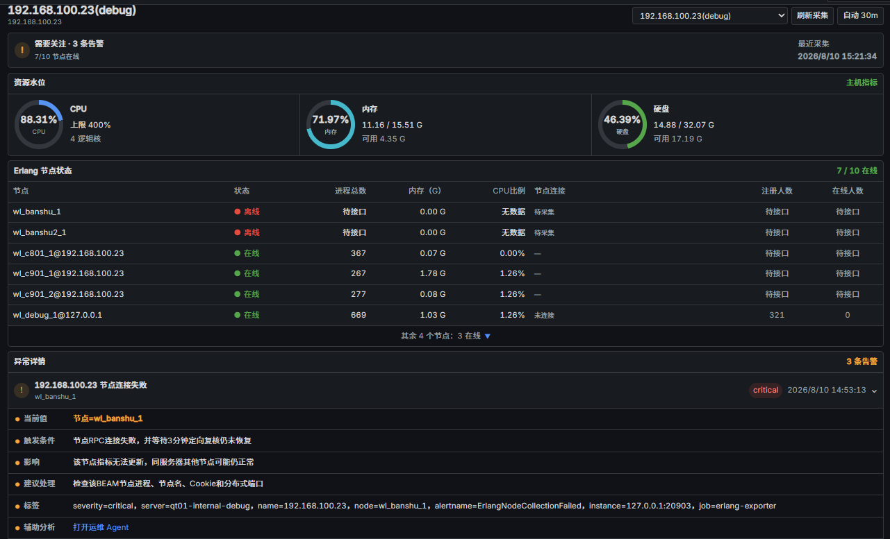
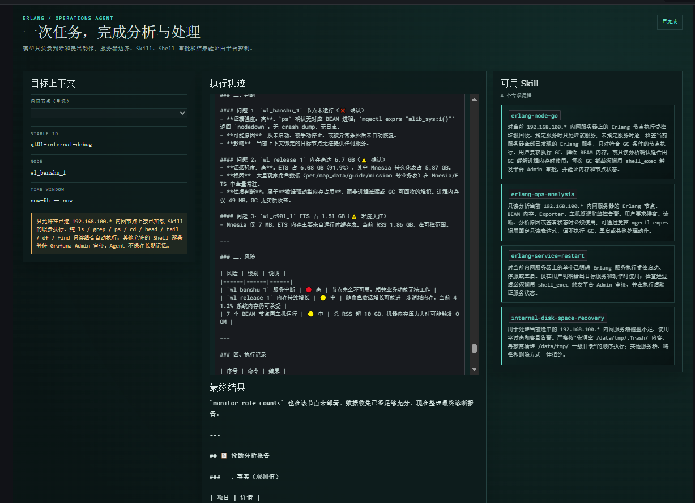
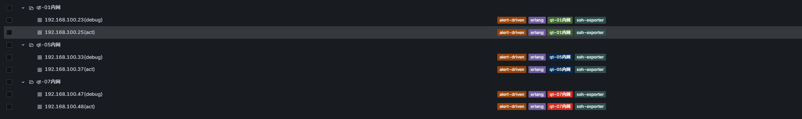

# Erlang 外服统一监控

外置、低侵入的 Erlang 游戏服监控平台。通过 SSH 在远端启动短生命周期的隐藏 Erlang 辅助节点执行只读 RPC，把主机与 BEAM 指标暴露给 Prometheus，再由 Alertmanager 经自研适配器推送钉钉。游戏服无需升级 OTP，也不必在现有项目中嵌入新依赖。

## 目录

- [架构](#架构)
- [核心能力](#核心能力)
- [仓库目录](#仓库目录)
- [快速开始（Windows）](#快速开始windows)
- [本地原生运行（Windows / Linux）](#本地原生运行windows--linux)
- [容器化部署](#容器化部署)
- [配置说明](#配置说明)
- [告警与钉钉通知](#告警与钉钉通知)
- [可选：HolmesGPT 根因分析](#可选holmesgpt-根因分析)
- [可选：运维 Ops Agent](#可选运维-ops-agent)
- [验证与测试](#验证与测试)
- [相关文档](#相关文档)

## 架构

```text
                                       ┌──────────────────────┐
   ┌────────────────┐  SSH + 只读 RPC   │  erlang-exporter    │
   │  游戏服（外服） │ ────────────────▶ │  Go :20903          │
   │  beam.smp 节点  │                   │  ─ /metrics         │
   └────────────────┘                   │  ─ /healthz         │
                                        │  ─ /status          │
                                        │  ─ /config/status   │
                                        │  ─ /schedule        │
                                        │  ─ /collect         │
                                        │  ─ /alertmanager    │
                                        │  ─ /dingtalk/healthz│
                                        └──────┬──────┬───────┘
                                               │      │
                          Prometheus 抓取 ◀────┘      │ DingTalk Markdown
                                                       ▼
   ┌────────────────┐   查询     ┌────────────────┐  ┌────────────────┐
   │   Grafana      │ ◀───────── │  Prometheus    │  │  钉钉机器人    │
   │   :20900       │            │  :20901        │  │  (HMAC 签名)   │
   └────────────────┘            └────────────────┘  └────────────────┘
           ▲                              ▲
           │                              │ 告警生命周期
           │                              ▼
           │                     ┌────────────────┐
           └──── 数据源 ─────────│  Alertmanager  │
                                 │  :20902        │
                                 └────────────────┘
```

可选服务（不阻断主链路）：

```text
   Grafana ──同源插件代理──▶ holmes-gateway (Go :20904) ──▶ HolmesGPT :20905 ──▶ GLM / Kimi
   Grafana ──同源插件代理──▶ ops-agent      (Go :20906) ──▶ GLM / Anthropic
```

### Agent 应用层

主链路（Exporter → Prometheus → Alertmanager → Grafana）只解决"采集、存储、告警、展示"。当告警发生时，仍然要由人去翻面板、SSH 上机器、跑 `mnode:i()` / `etop` / `observer` 才能定位根因。Agent 应用层在主链路之外加两条可选通道，把"分析决策"和"低风险动作"分别交给受控的 LLM 流程，避免把 SSH 凭据或排查上下文直接放到浏览器或模型手里。

#### HolmesGPT 根因分析（`cmd/holmes-gateway` + Holmes Server）

| 组件 | 默认端口 | 职责 |
| --- | --- | --- |
| Grafana 插件代理 | 同源 20900 | 浏览器只与 Grafana 通信；插件用 `secureJsonData` 注入内部 Bearer Token 和真实 `X-Grafana-User` |
| `holmes-gateway`（Go） | `127.0.0.1:20904` | 会话状态机、工具白名单、Admin 单次审批、SSE 转换、JSONL 审计、`glm`/`kimi` 别名过滤 |
| Holmes Server（Python 3.11） | `127.0.0.1:20905` | HolmesGPT 0.38.1（固定 commit），多轮工具调用，调用 GLM / Kimi |
| Exporter（已有） | `127.0.0.1:20903` | 提供 Prometheus 指标查询、受控 SSH/Erlang 诊断接口 |

流程：用户在 Grafana 的 `/a/erlang-monitor-controls-app/holmes` 页面发起调查 → 插件代理转发到 Gateway，带入固定 `server_id`、节点候选、时间范围和最多一个匹配告警 → Gateway 用 `glm`/`kimi` 别名调用模型，模型只能用 `get_host_snapshot`、`list_erlang_nodes`、`get_node_snapshot`、`get_scheduler_hotspots`、`get_process_hotspots` 五个受控工具 → 任何 SSH 或 RPC 调用都经过 Exporter 现有的 SSH + 一次性隐藏 Erlang 节点通道，不接受模型自报的 IP/端口/密钥 → Admin 在页面单次审批后工具才会真正执行，最多 12 次工具调用、累计 256 KiB 输出、单工具 10/45 秒超时。

不放出的东西：上游模型 ID、API Base、API Key、推理过程字段、`role_数字` / 11 位以上业务标识（脱敏）、认证头、完整 SSH 配置。会话 JSON 持久化在 Gateway 本地，7 天/100 会话保留，重启可恢复但失败时不破坏新轮次。

#### Ops Agent 单任务运维（`cmd/ops-agent`）

| 组件 | 默认端口 | 职责 |
| --- | --- | --- |
| Grafana 插件代理 | 同源 20900 | 同上，注入 `ops_agent_tool_api_token` |
| `ops-agent`（Go） | `127.0.0.1:20906` | 单任务编排、Skill 加载、Shell 审批、超时与脱敏 |
| 内网游戏服 | `192.168.100.*` | 仅允许配置清单中的内网地址；不允许横向 SSH |

流程：Editor 在 `/a/erlang-monitor-controls-app/ops-agent` 页面选择一台内网节点并提问 → Agent 加载 `ops-agent/skills/*/SKILL.md` 中的一个 Skill，未加载 Skill 时拒绝任何 Shell 调用 → Shell 命令必须先经过通用安全校验、内网服务器校验和 Skill 职责校验三道闸 → 纯 `ls/grep/ps/cd/head/tail/df/find` 只读组合直接执行；`find -exec*/-delete*` 等可写/可执行谓词进 Grafana Admin 单次审批 → 输出脱敏后返回模型 → 最长 30 分钟、单任务、内存内状态、不提供长期记忆。

永久拒绝（Admin 批准也不能绕过）：删除白名单外路径、主机关停与格式化、提权、手工杀进程、横向 SSH、读取服务器隐私数据。

#### Agent 与主链路的依赖关系

- HolmesGPT 和 Ops Agent 都依赖 Exporter 已配置的服务器清单与 SSH 通道，自身不持有第二种 SSH 凭据；Exporter 没有部署的机器，Agent 也无法触达。
- HolmesGPT 依赖 Prometheus 提供告警上下文（标签、时间范围），但 Prometheus 不可用时 Gateway 仍可基于 Exporter `/status` 与受控工具完成调查。
- Ops Agent 与 HolmesGPT 互相独立：停掉任一 profile 都不影响主链路和另一个 Agent。
- 两条 Agent 通道都是可选 profile（`--profile holmes` / `--profile ops-agent`），不部署时不消耗资源、不开放额外端口。

### 关键信任边界

- 浏览器只访问 Grafana（同源插件代理），不直接持有 Holmes、模型、Prometheus 或 SSH 凭据。
- Exporter 通过 SSH 在远端启动一次性隐藏 Erlang 节点执行只读 RPC，不在游戏服上留存进程或文件。
- 所有 Secret 通过文件或环境变量注入，不写入 YAML，也不进入日志。

## 核心能力

- **多服务器配置化**：支持加密 OpenSSH 私钥、主机指纹或 `known_hosts` 校验。
- **自动发现 `beam.smp` 节点**：可配置 `instance_directory` 按实例结构扫描，兼容一级 `wl_*/server`、`ysmw_*/server` 与旧版 `/data/server` 下第二层 `wl_*` 布局；自动忽略 `logs`、`tmp`、`backup`、`accter` 和 `.bk.*` 备份目录。
- **主机指标**：CPU、1 分钟负载、内存总量/已用/可用、文件系统使用率、运行时间、网络收发带宽。
- **Erlang 指标**：节点状态、`mnode:i()` 采集的中央/赛区节点连接、BEAM 进程 RSS 内存与 CPU 占比、进程数/上限、VM 内存、Run Queue、调度器、Atom、Port、最大单进程内存、最大消息队列及对应 PID/注册名/初始函数/当前函数。
- **玩家人数**：调用 `mlib_sys:monitor_role_counts/0` 采集 `total_role_count` 与 `online_role_count`；接口未部署或返回异常时保持 `NaN`，绝不用 BEAM 进程数冒充。
- **分级复核**：默认 30 分钟采集；Run Queue 异常 10 秒定向复查；节点 RPC 失败或进程消失 3 分钟定向复查；主机/发现失败 10 秒复核；其他资源异常直接交 Prometheus 规则判断。
- **配置热加载**：Exporter 每 5 秒以 SHA-256 比对配置文件，校验通过后热更新默认项与服务器项，错误配置不会替换当前有效配置。
- **结构化日志 + 状态持久化**：JSON 日志、持久化的最后状态文件，便于故障后直接定位。
- **集成钉钉适配器**：Markdown 通知、HMAC 签名、按服务器 glob 过滤接收人、恢复通知，统一在 Exporter 进程内提供。
- **可选 HolmesGPT 根因分析**：独立 Go 网关、GLM/Kimi 别名、Prometheus 只读证据、受控 SSH/Erlang 工具、Admin 单次审批、会话恢复和 JSONL 审计。
- **可选运维 Ops Agent**：单任务、单服务器、Skill 受控的轻量 Agent，白名单 Shell 自动执行，可写/可执行谓词经 Grafana Admin 单次审批。

## 仓库目录

```text
cmd/
  erlang-exporter/          # 主采集器 + 钉钉适配器入口（:20903）
  holmes-gateway/           # HolmesGPT 网关入口（:20904）
  ops-agent/                # 运维 Agent 入口（:20906）
  holmes-diagnostic-smoke/  # Holmes 诊断冒烟工具
internal/
  config/                   # YAML 加载 + 热重载
  exporter/                 # Prometheus 指标 + 调度器
  sshprobe/                 # SSH + Erlang RPC 采集
  dingtalk/                 # 钉钉适配器
  holmesgateway/            # Holmes 网关逻辑
  opsagent/                 # Ops Agent 逻辑
  runtime/                  # 状态持久化
  sshprobe/                 # SSH 与诊断
  deployconfig/             # 部署清单
config/
  servers.example.yml       # 可提交的服务器配置模板
  servers.native.yml        # Windows/Linux 原生运行时共用版本（Git 忽略 servers.yml / servers.local.yml）
  examples/                 # 其他示例片段
prometheus/                 # 抓取配置 + 16 条告警规则
alertmanager/               # 分组、抑制、钉钉路由
grafana/                    # 数据源、仪表板、unsigned 插件 erlang-monitor-controls-app
holmes/                     # HolmesGPT 配置、Skills、模型清单
ops-agent/                  # Ops Agent 配置、Skills
scripts/                    # PowerShell 启动、验证、安装脚本
docs/                       # 部署规划、测试手册、Holmes/Ops-Agent 接入说明
linux/                      # Linux 原生部署辅助
secrets/                    # 本地 Secret（Git 忽略，仅保留 .gitkeep 与 README）
data/                       # 运行时状态文件（Git 忽略）
logs/                       # 运行日志（Git 忽略）
.runtime/                   # 本地一键启动器下载的 Prometheus/Alertmanager/Grafana（Git 忽略）
bin/                        # 本地构建产物（Git 忽略）
compose.yml                 # 主监控栈
compose.holmes.yml          # HolmesGPT 叠加层
compose.ops-agent.yml       # Ops Agent 叠加层
Dockerfile                  # 多阶段构建（exporter / gateway / ops-agent）
启动本地监控.cmd            # Windows 一键启动器
```

## 快速开始（Windows）

只适合本机调试。正式部署见 [容器化部署](#容器化部署)。

1. 双击根目录 `启动本地监控.cmd`（**不要**直接双击 `bin/` 或 `.runtime/` 里的 EXE，它们是命令行服务，缺少参数会立即退出）。
2. 启动器依次完成：
   - 优先选择 `config/servers.native.yml`，其次 `config/servers.yml`，并先校验服务器配置。
   - 首次以隐藏输入方式要求粘贴 Webhook，保存到 Git 忽略的 `secrets/dingtalk_webhook_url`。
   - 自动下载并校验 Prometheus 3.5.0、Alertmanager 0.28.1、Grafana 12.1.0 官方 Windows 包（约 420 MiB），安装到 Git 忽略的 `.runtime/`。
   - 依次启动 Exporter、Alertmanager、Prometheus、Grafana，等待健康检查通过后自动打开 Grafana 总览。
3. 启动器使用 `PowerShell -NoExit` 打开独立窗口；启动失败时窗口保留并显示真实错误。正常运行时按 `Ctrl+C` 停止由该窗口启动的服务。若端口上已有健康的本项目服务，会安全复用而不停止它。

本地客户端与诊断地址：

| 服务 | 地址 |
| --- | --- |
| Grafana 总览（kiosk） | `http://127.0.0.1:20900/?erlang-monitor-dashboard=erlang-monitor-overview&kiosk` |
| Prometheus | `http://127.0.0.1:20901` |
| Alertmanager | `http://127.0.0.1:20902` |
| Exporter 状态 | `http://127.0.0.1:20903/status` |
| Exporter 配置状态 | `http://127.0.0.1:20903/config/status` |

Grafana 总览由预加载的 `erlang-monitor-controls-app` Viewer 页面动态渲染：圆形资源仪表按单核 100% 口径展示 CPU 当前值与逻辑核上限；内存与硬盘按 G 保留两位小数；节点状态以表格展示；活动告警按"当前值、触发条件、影响、建议处理、标签"逐行展开。游客侧边导航仅保留"仪表板"，已登录用户保留完整 Grafana 导航。

## 本地原生运行（Windows / Linux）

手工启动前先复制配置：

```powershell
Copy-Item .\config\servers.example.yml .\config\servers.yml
# 或与启动器一致：
Copy-Item .\config\servers.example.yml .\config\servers.native.yml
```

Windows 与 Linux 原生运行时共用可版本化的 `config/servers.native.yml`。旧的 `config/servers.local.yml` 保持忽略，仅用于兼容机器本地配置。SSH 身份文件统一使用 `secrets/ssh/...` 项目相对路径。两端只需在各自的 `secrets` 目录准备私钥、公钥和口令文件，不要把 Secret 值写入 YAML 或同步到仓库。容器运行则使用 `/run/secrets/...` 路径。

使用本机 OpenSSH Agent 时，配置 `use_ssh_agent: true` 和 `ssh_key_file`。`ssh_key_file` 可指向 OpenSSH 公钥、未加密私钥或带口令的 OpenSSH 私钥；Exporter 只从文件取得公钥身份，用来精确选择 Agent 中已解锁的同一把密钥，不会使用该文件直接登录，也不需要在 YAML 里写入口令。

Windows 与 Linux 原生 Grafana 共用 `grafana/grafana.local.ini` 中的语言、匿名权限、数据代理和插件等逻辑配置。启动层只覆盖数据目录、对外域名等环境差异，并从各自的 `secrets/grafana_admin_password` 注入管理员密码。Windows 本地仅绑定 `127.0.0.1`；Linux 同样只监听回环地址，由 Nginx 提供对外 HTTPS。

## 容器化部署

正式部署前创建下列未纳入 Git 的文件：

```text
config/servers.yml
.env                                # 由 .env.example 复制
secrets/monitor_private_key
secrets/monitor_private_key_passphrase
secrets/dingtalk_webhook_url
secrets/dingtalk_secret
secrets/dingtalk_at_mobiles
secrets/dingtalk_at_user_ids
secrets/grafana_admin_password
secrets/holmes_api_key              # 启用 Holmes 时
secrets/holmes_tool_api_token       # 启用 Holmes 时
secrets/glm_api_key                 # 启用 Holmes 时
secrets/kimi_api_key                # 启用 Holmes 时
secrets/ops_agent_model_api_key     # 启用 Ops Agent 时
secrets/ops_agent_tool_api_token    # 启用 Ops Agent 时
```

主监控栈（Exporter + Prometheus + Alertmanager + Grafana）：

```bash
cp .env.example .env
docker compose -f compose.yml up -d --build
```

默认只绑定 `127.0.0.1`。确认内网 ACL 与防火墙后，再在 `.env` 中把 `MONITOR_BIND_IP` 改为监控服务器的内网 IP。

默认端口映射：

| 服务 | 容器端口 | 主机端口 |
| --- | --- | --- |
| Grafana | 20900 | `${MONITOR_BIND_IP:-127.0.0.1}:20900` |
| Prometheus | 20901 | `${MONITOR_BIND_IP:-127.0.0.1}:20901` |
| Alertmanager | 20902 | `${MONITOR_BIND_IP:-127.0.0.1}:20902` |
| Erlang Exporter | 20903 | `127.0.0.1:20903`（仅容器内可达） |
| Holmes Gateway | 20904 | `${MONITOR_BIND_IP:-127.0.0.1}:20904` |
| Holmes Server | 20905 | 仅容器内 |
| Ops Agent | 20906 | `${MONITOR_BIND_IP:-127.0.0.1}:20906` |

## 配置说明

完整示例见 [config/servers.example.yml](config/servers.example.yml)。

### 默认阈值

| 项目 | 默认值 |
| --- | ---: |
| 常规采集 | 30 分钟 |
| 主机/整机采集失败确认 | 等待 10 秒后复核 1 次 |
| 节点连接/进程消失确认 | 等待 3 分钟后定向复核 1 次 |
| Run Queue 异常 | 超过告警倍数后等待 10 秒定向复查 1 次 |
| 其他资源异常 | 不进入 Exporter 复核队列，直接由 Prometheus 规则判断 |
| 数据过期 | 40 分钟没有成功采集 |
| 主机 CPU/内存告警 | 80%（按服务器配置） |
| BEAM 总内存 | 10 GiB 展示，15 GiB 告警 |
| 消息队列 | 100 条 |
| 单 Erlang 进程内存 | 200 MiB |
| Process/Atom/Port 容量 | 80%（按服务器配置） |
| Run Queue | 调度器 4 倍展示；超过 16 倍后 10 秒定向复查，复查仍高并保持 10 分钟告警；仅在平台内保留，不推送钉钉 |
| SSH 连接超时 | 10 秒 |
| 远端命令超时 | 45 秒（示例） |

### 实例目录扫描

每台服务器可选配置 `instance_directory`：

- 配置为 `/data` 时，采集器只认一级 `wl_*` 或 `ysmw_*` 实例下真实存在的 `server` 目录；不会把 `/data/logs`、`/data/tmp` 或 `/data/backup` 里的同名目录算成节点。
- 配置根目录本身是 `/data/server` 时，兼容其第二层 `wl_*` 节点目录布局。
- 名称包含 `accter`、以 `.bk` 结尾或包含 `.bk.` 的目录会被排除。
- 预期目录存在但找不到对应 `beam.smp` 进程时，会等待 3 分钟定向复核；Prometheus 持续看到 `node_up=0` 满 5 分钟后才告警，为复核与指标传播预留时间。

### 节点告警通知过滤

`alert_filters.ignored_nodes` 可按服务器 ID 过滤节点的钉钉通知。匹配的告警仍保留在 Prometheus、Alertmanager 和 Grafana 中，只是不调用钉钉机器人。节点值既可写完整名称，也可使用 `*`、`?` 和 `[]` glob 通配符：

```yaml
alert_filters:
  ignored_nodes:
    qt01-internal-act:
      - "wl_act_8.bk.1785811556"
      - "wl_temporary_?@127.0.0.1"
```

服务器 ID 必须存在，通配模式必须合法，否则配置会被拒绝并继续使用上一份有效配置。修改当前配置文件后约 5 秒热加载，无需重启监控。日志事件 `dingtalk-alerts-filtered` 和指标 `dingtalk_adapter_alerts_filtered_total{server="..."}` 可用于确认命中情况。

### 配置热加载

Exporter 独立管理 `-config` 指定的服务器配置文件（本地原生启动通常为 `config/servers.native.yml`）。扫描器按文件内容 SHA-256 判断变化，不依赖可能不稳定的文件修改时间：

- **新增或重新启用服务器**：创建调度任务并立即采集一次。
- **修改已有服务器的任意字段或默认值**：保留该服务器当前的 `auto/refresh` 模式，应用完整新配置并立即采集一次；`poll_interval` 从本次更新后重新计时。
- **停用或删除服务器**：取消对应任务，并清除 Exporter 中的运行状态和指标序列。
- **YAML 语法或完整性校验失败**：记录 `config-reload-rejected`，继续使用最后一份有效配置。修正并再次保存后自动恢复热加载。

`http://127.0.0.1:20903/config/status` 只返回配置版本、加载/检查时间、最近错误、节点通知过滤规则以及非敏感的服务器摘要，不返回用户名、密钥路径或口令。版本从 1 开始，每次成功热加载递增。

配置成功加载后会自动采集。Prometheus 下一次抓取后，浏览器重新加载页面可以查询到新配置产生的数据。点击 Grafana 顶部的 `Refresh` 会再按 Exporter 当前配置触发一次采集，并等待 Prometheus 抓到该次结果后刷新面板。浏览器 F5 本身只重新查询 Prometheus；如果恰好发生在热加载采集完成之前，可能短暂看到上一份样本。

页面当前仍以服务器 `name` 关联指标，因此已有页面对应服务器的 `name` 应保持稳定；修改阈值、采集周期、SSH 参数、地址端口等不会改变页面关联。新增服务器或修改 `name` 不会自动生成/改写 Grafana Dashboard，仍需同步部署对应页面文件。

> 主机指纹必须与已经信任的 CRT 会话记录核对。`ssh-keyscan` 只能用于获取候选指纹，不能单独作为信任依据。生产配置不得使用 `insecure_skip_host_key`。

## 告警与钉钉通知

Prometheus 规则覆盖：节点连接、BEAM 内存、消息队列、单进程内存、Process/Atom/Port 容量、Run Queue，以及主机 CPU/内存/磁盘风险（共 16 条，已通过官方 `promtool v3.5.0` 校验）。

Alertmanager 按 `alertname/severity/server/node` 分组，首次等待 15 秒、同组间隔 5 分钟。同一告警在未恢复前的重复间隔设置为一年，等价于每次事件只通知一次；恢复后再次触发会作为新事件重新通知。Run Queue 告警仅保留在 Prometheus/Alertmanager/Grafana，不推送钉钉。

内置钉钉模块（集成在 Exporter 内，不需要单独启动适配器）：

- 接收 Alertmanager Webhook，将同组告警生成 Markdown。
- 支持钉钉自定义机器人 HMAC 签名和恢复通知。
- 机密信息优先通过文件传入：`DINGTALK_WEBHOOK_URL_FILE`、`DINGTALK_SECRET_FILE`、`DINGTALK_AT_MOBILES_FILE`、`DINGTALK_AT_USER_IDS_FILE`。
- 本地启动器自动读取 Git 忽略目录中的 `secrets/dingtalk_at_mobiles` 和 `secrets/dingtalk_at_user_ids`；接收人文件支持逗号、分号或换行分隔。
- 仅触发告警时 @ 指定人；恢复通知不会 @。
- 若接收人文件都不存在，告警仍会发送，但不会 @ 任何人。无需重建程序，重启本地监控后生效。
- Alertmanager 将 `server` 标签匹配 `qt[0-9]+-internal-.*` 的内网告警路由到不 @ 人的接收器；消息仍正常发送。
- 发送失败时内置模块返回 HTTP 502，让 Alertmanager 按自身机制重试；失败原因写入状态文件并使 `/dingtalk/healthz` 返回 503。Webhook 地址、签名密钥和 SSH 口令不会进入日志。
- 当前测试机器人的安全关键词已验证为 `服务器`，默认标题前缀 `[Erlang服务器监控]`，标题根据 `server` 标签追加 `【qt-01】` 等区服标识；正文以中文摘要为事件标题，将 `condition` 显示为"判断条件"。恢复通知只保留对象、当前值、标签和时间。更换机器人后应同步核对其安全关键词或 HMAC 配置。

## 可选：HolmesGPT 根因分析

HolmesGPT 0.38.1（固定版本）提供告警根因分析：独立 Go 网关、GLM/Kimi 服务端别名、Prometheus 只读证据、受控 SSH/Erlang 工具、Admin 单次审批、会话恢复和 JSONL 审计。Holmes 不可用不阻断原监控链路。

需求基线见 [docs/holmesgpt-integration-requirements.md](docs/holmesgpt-integration-requirements.md)，接入说明见 [docs/holmesgpt-operations.md](docs/holmesgpt-operations.md)。没有真实模型 Secret 时不会运行或声称通过 GLM/Kimi 烟测。

容器启动：

```bash
docker compose -f compose.yml -f compose.holmes.yml --profile holmes up -d --build
```

Grafana 页面为 `/a/erlang-monitor-controls-app/holmes`。每台 Erlang 仪表板会出现"Holmes 分析"入口，带入固定服务器、节点候选、当前时间范围，以及与所选节点匹配的一个活动告警。

## 可选：运维 Ops Agent

`cmd/ops-agent` 提供一个不依赖 Holmes 的轻量 Agent：只接受配置地址属于 `192.168.100.*` 的当前内网服务器，并且必须先加载 `ops-agent/skills` 中的项目 Skill，Shell 只能服务于已加载 Skill 的职责。

- 完全由 `ls`、`grep`、`ps`、`cd`、`head`、`tail`、`df`、`find` 组成的只读单命令、管道或 `&&` 组合自动执行。
- `find -exec/-execdir/-ok/-okdir/-delete/-fls/-fprint*` 等可写或可执行谓词以及其他允许的 Shell 仍由 Grafana Admin 单次审批。
- 删除白名单外路径、主机关停与格式化、提权、手工杀进程、横向 SSH 和服务器隐私读取由后端永久拒绝，Admin 批准也不能绕过。
- Shell 输出返回前会进行敏感信息脱敏。
- 任务最长 30 分钟，仅保存在进程内存中，不提供长期记忆或跨任务恢复。

准备 `secrets/ops_agent_model_api_key` 和 `secrets/ops_agent_tool_api_token`，按实际供应商修改 `ops-agent/config.container.yml` 的 OpenAI 兼容地址和模型，然后启动可选覆盖层：

```bash
docker compose -f compose.yml -f compose.ops-agent.yml --profile ops-agent up -d --build
```

运维入口为 `/a/erlang-monitor-controls-app/ops-agent`。`current-server` 始终由服务端清单解析；模型不能提交 IP、SSH 用户、端口或密钥。第一版 Shell 审批是安全闸门而不是完整系统沙箱，生产使用前仍应把高频处理动作收敛为固定 Skill 脚本。

Ops Agent 职责、权限、流程和 Shell 安全边界见 [docs/ops-agent-overview.md](docs/ops-agent-overview.md)。

> Exporter 只为每个节点当前"最大内存进程"和"最大消息队列进程"各保留一组 PID/函数标签，旧进程标签在新快照到达时立即删除，标签规模被限制为每节点两组。不会采集角色 ID、地图实例、消息正文、进程 dictionary 或业务状态。

## 验证与测试

### 本地验证脚本

本机系统 Go 1.22.1 的标准库不完整，项目验证使用 Go 1.22.12 工具链：

```powershell
Set-Location 'D:\QcUsers\Win10\文档\01-外服状态检测'
powershell -ExecutionPolicy Bypass -File .\scripts\verify.ps1
```

脚本会运行格式检查、`go vet`、全部单元测试、两个 Windows 可执行文件构建、示例配置与 Grafana JSON 检查。若已安装本地原生运行时，还会用官方 `promtool` 和 `amtool` 检查非 Docker 配置。若本机没有 Docker，会明确跳过 Compose 运行验证。

### 配置校验

```powershell
# Exporter 配置
.\bin\erlang-exporter.exe -config config/servers.example.yml -check-config

# Holmes 网关配置（任一目标配置）
.\bin\holmes-gateway.exe -config holmes/gateway.example.yml -servers config/servers.example.yml -check-config
```

### 真实模型烟测

普通聊天成功不等于可用。生产模型必须用 `scripts/smoke-real-models.ps1` 分别完成 Prometheus、受控诊断、至少两轮工具、审批暂停、成功的热点调用、最终中文 RCA 和连续追问。该脚本默认拒绝运行，只有提供 Secret、核对模型成本并同时传入 `-Execute -ApproveHotspots` 后才会调用真实供应商。`-RequireCompaction` 把真实上下文压缩作为强制门槛。详见 [docs/holmesgpt-operations.md](docs/holmesgpt-operations.md)。

### 集成端到端验证

集成模式已使用本项目 `bin/erlang-exporter.exe` 完成真实钉钉端到端验证，验证编号 `INTEGRATED-E2E-1785744803678`：`/alertmanager` 返回 `ok`、`/dingtalk/healthz` 与 Exporter `/healthz` 均为 `healthy`，成功计数 `dingtalk_adapter_send_total{result="success"}` 为 1。容器运行、Grafana 渲染及 `.22/.24` 部署仍未执行。

### 2026-08-03 只读现场验证

使用本机 OpenSSH Agent 中的既有密钥连接外服，连续两轮真实 Exporter 采集均为 13/13 正式游戏节点成功，最终 `/status` 为 `healthy`，单轮约 6 秒。第二轮主机 CPU 约 13.36%，总内存约 61.93 GiB、可用约 32.51 GiB；当次最大单 Erlang 进程内存约 93.86 MiB，未超过 200 MiB 阈值，也没有节点出现超过 100 条的进程消息队列。

验证期间没有向远端写文件、安装软件、停止进程或修改服务。该结果是当时快照，不代表持续健康。当前 Prometheus 规则已通过官方 `promtool v3.5.0`（16 条），Alertmanager 配置已通过官方 `amtool v0.28.1`。

调度热点进程需要按时间窗口计算 reductions 增量，接口需求见 [docs/future/mlib_sys-monitoring-requirements.md](docs/future/mlib_sys-monitoring-requirements.md)。

### 尚未替代的运行验证

本地 Go 测试不能单独证明容器启动、Grafana 实际渲染以及 `.22/.24` 双机部署；这些事项应在本地实现验收后按部署决策门逐项验证。真实钉钉机器人收发和 Prometheus/Alertmanager 官方配置检查已另行完成。

## 效果说明

Grafana 总览由预加载的 `erlang-monitor-controls-app` 插件动态渲染，游客侧边导航仅保留"仪表板"。圆形资源仪表按单核 100% 口径展示 CPU 当前值与逻辑核上限；内存与硬盘按 G 保留两位小数；节点状态以表格展示；活动告警按"当前值、触发条件、影响、建议处理、标签"逐行展开。

### 资源总览与活动告警



CPU、内存、磁盘仪表 + 节点状态表 + 活动告警列表，同一页面完成"主机是否健康 / BEAM 节点是否在线 / 当前告警是否需要处置"三层判断。

### 多服务器节点视图



按服务器分页展示节点状态、连接拓扑和详细指标，每个 `qt-01` / `qt-05` / `qt-07` 页面顶部使用 Grafana 动态仪表板链接自动列出所有同标签页面，跨页面跳转不会把上一页 IP 错误带入。

### 节点清单与标签



每台服务器节点的展示名、稳定 ID 和 `erlang` / `qt-*内网` / `ssh-exporter` 等标签一目了然，便于按节点名或服务器 IP 定位。

## 双机部署规划

`docs/deployment/inventory.yml` 目前仅记录候选角色，不会自动连接或部署：

- `192.168.100.22`：主监控节点，计划运行全套服务。
- `192.168.100.24`：备用节点，先保留，后续可做 Prometheus 远端存储或高可用 Alertmanager/Grafana。

真正部署前必须只读确认两台机器的 SSH 端口（`61618` 只是现有内网惯例）、操作系统、CPU/内存、磁盘余量、Docker 或 Podman 版本、时钟同步、出口访问钉钉能力及入站防火墙。当前阶段不连接、不安装、不改服务。

## 相关文档

- [测试人员配置与验收手册](docs/tester-configuration-guide.md)
- [运维 Agent 权限、流程与职责说明](docs/ops-agent-overview.md)
- [HolmesGPT 运维根因分析接入需求](docs/holmesgpt-integration-requirements.md)
- [HolmesGPT 运维根因分析接入说明](docs/holmesgpt-operations.md)
- [调度控制接口](docs/scheduling-control.md)
- [部署清单](docs/deployment/inventory.yml)
