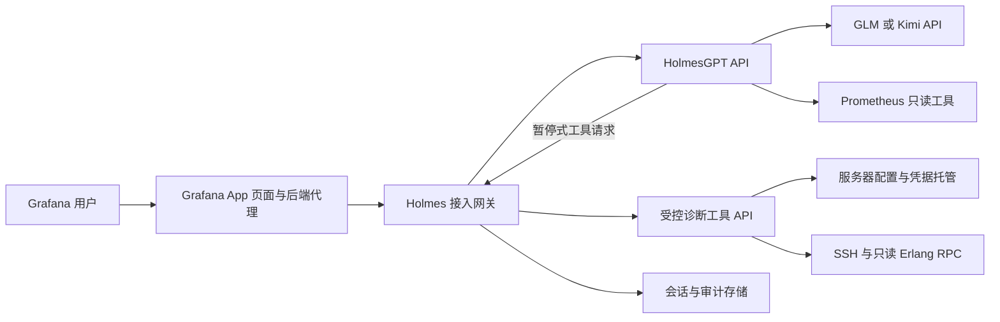

# HolmesGPT 运维根因分析接入需求

状态：待实现  
版本：v1.0  
日期：2026-08-04  
目标读者：首次接触本项目、负责完成接入的开发者或编码 Agent

## 1. 阅读完成后要做什么

实现者应能仅依据本文，在现有 Erlang 外服监控平台中增加一个安全、可审计、支持多轮工具调用的 HolmesGPT 根因分析工作台，并完成 GLM/Kimi、Prometheus、受控 SSH 诊断、会话管理和 Grafana 页面入口的端到端验证。

本文描述的是目标行为和验收边界，不代表功能已经实现。现有静态示意图仅用于确认交互方向，不能作为运行验证证据。

## 2. 背景与现状

现有平台采用低侵入架构：Exporter 通过 SSH 和只读 Erlang RPC 采集外服主机及 BEAM 指标，Prometheus 保存和查询时序数据，Alertmanager 处理告警，Grafana 展示每台服务器的仪表板，钉钉适配器负责通知。

当前组件及默认端口如下：

| 组件 | 默认地址 | 用途 |
|---|---|---|
| Grafana | `127.0.0.1:20900` | 仪表板和用户入口 |
| Prometheus | `127.0.0.1:20901` | 指标、PromQL 和告警状态 |
| Alertmanager | `127.0.0.1:20902` | 告警生命周期 |
| Erlang Exporter | `127.0.0.1:20903` | SSH/RPC 采集、状态和钉钉适配 |

Grafana 已有一个预加载 App 插件，用于识别当前仪表板绑定的服务器并通过 Grafana 后端代理触发采集。新功能应复用这一“浏览器只访问 Grafana 后端代理”的信任边界，不应让浏览器直接持有 Holmes、LLM、Prometheus 或 SSH 凭据。

服务器监控配置已经包含稳定的服务器 ID、展示名称、SSH 地址、用户、主机指纹、密钥来源和超时。Holmes 调查必须引用服务器 ID，不允许模型自行提供任意主机、端口、用户名或密钥路径。

## 3. 产品目标

### 3.1 核心目标

1. 用户能从当前服务器仪表板一键发起根因分析，服务器、节点、告警和时间范围自动成为调查上下文。
2. 用户能选择 GLM 或 Kimi，查看 Holmes 的多步调查进度、工具证据、最终根因、置信度和建议。
3. Holmes 能查询现有 Prometheus，并通过受控后端工具执行有限、只读、有界的 SSH/Erlang 诊断。
4. 调查过程支持连续追问；会话在刷新页面或 Holmes 发生上下文压缩后仍能继续。
5. 所有 API Key、SSH 凭据和内部认证信息只存在于服务端，并从日志、页面、模型上下文和调查结果中剔除。
6. 现有采集、告警、Grafana 仪表板和钉钉通知不能因 Holmes 不可用而中断。

### 3.2 成功指标

- 从一个现有告警开始，用户不手工复制服务器 IP 即可完成一次调查。
- 至少一个 GLM 模型和一个 Kimi 模型分别通过两轮连续工具调用烟测。
- 调查失败时能区分模型错误、Holmes 错误、Prometheus 错误、TCP 不可达、SSH 握手失败、SSH 认证失败、远端命令失败和 Erlang RPC 失败。
- 默认配置下不存在浏览器可读取的上游模型 Key、SSH 私钥或 SSH 私钥口令。
- Holmes 停止运行后，现有监控和告警功能继续正常工作。

## 4. 范围

### 4.1 本期必须实现

- 独立 HolmesGPT 服务，固定可复现版本，要求版本不低于 `0.26.0`，以使用 Skills。
- Holmes 接入网关，作为 Grafana 与 Holmes 之间的稳定后端边界。
- GLM、Kimi 多模型服务端配置和页面模型选择。
- Holmes API 鉴权、超时、流式事件转发、错误归一化和模型清单过滤。
- Grafana 中的 Holmes 分析入口及独立分析工作台。
- 调查会话创建、追问、恢复、上下文更新、状态和有限持久化。
- Prometheus 只读工具。
- 受控 SSH/Erlang 诊断工具，不开放通用 Shell。
- SSH 工具审批界面和完整审计记录。
- 一个面向本项目的 Erlang 根因分析 Skill。
- 本地 Windows 启动方式和容器部署方式。
- 自动化验证、无真实 Key 的测试替身，以及有 Key 时才运行的真实模型烟测。

### 4.2 本期不实现

- 自动重启节点、杀进程、清缓存、改配置、发版或执行任意修复命令。
- 把 SSH 私钥、私钥口令、Agent Socket 或模型 Key 透传给浏览器或 LLM。
- 允许模型指定任意 IP、端口、用户名、URL 或 Shell 命令。
- 替换现有 Exporter、Prometheus、Alertmanager、Grafana 或钉钉链路。
- 修改游戏业务代码或要求游戏服升级 OTP。
- 把聊天回答直接当作已验证根因；没有证据时必须输出“不确定”。
- 默认将公网用户或 Grafana 匿名 Viewer 暴露给付费模型和 SSH 调查能力。

## 5. 总体架构



架构约束：

1. Grafana 前端只能调用同源 Grafana 后端代理。
2. 网关负责 Holmes 认证、会话、限流、事件转换、审计和脱敏；前端不能直连 Holmes。
3. Holmes 负责 LLM 编排、工具选择、多轮推理、上下文压缩和最终回答。
4. Prometheus 使用 Holmes 内置只读工具集。
5. SSH 诊断以 Holmes 的暂停式前端工具声明给模型，但实际执行者是网关和受控诊断工具服务，不是浏览器；禁止把通用 Bash 或原始 SSH 暴露给 Holmes。
6. 模型只能看到诊断结果，不得看到凭据、配置文件内容、内部 Token 或完整环境变量。

## 6. 模型接入需求

### 6.1 多模型配置

Holmes 必须使用服务端模型清单，并以稳定别名对外提供模型。上游具体模型 ID 是部署配置，不能硬编码在前端。

推荐基线：

```yaml
glm:
  model: openai/glm-5.2
  api_base: https://open.bigmodel.cn/api/paas/v4
  api_key: "{{ env.GLM_API_KEY }}"

kimi:
  model: openai/kimi-k3
  api_base: https://api.moonshot.cn/v1
  api_key: "{{ env.KIMI_API_KEY }}"
```

要求：

- 实际模型 ID 必须以账号当时可用的模型清单为准；前端只使用 `glm`、`kimi` 等别名。
- Kimi K3 不显式传递 `temperature`。
- GLM 默认走 OpenAI 兼容入口，降低 LiteLLM 协议和鉴权转换的不确定性。
- 智谱 Anthropic 兼容入口可作为可选配置，但不能作为唯一实现路径；若启用，必须单独验证认证头、流式输出和工具调用。
- 不做静默自动模型切换。模型失败后应展示原因，并允许用户明确选择另一个模型重试，避免同一会话无提示地改变行为和成本。
- 网关只能向页面返回允许使用的模型别名和显示名称，不返回 `api_base`、真实模型凭据或完整 Holmes 配置。

### 6.2 模型能力门槛

模型必须通过以下能力测试后才能标记为“可用于根因分析”：

1. 单轮中文问答。
2. 正确生成一次工具调用。
3. 接收工具结果后继续推理。
4. 连续完成至少两轮工具调用。
5. 处理工具超时、空结果和权限拒绝。
6. 输出包含结论、证据、置信度、未确认项和建议的中文结果。
7. 长会话触发上下文压缩后能够继续追问。

只能聊天但不能稳定完成上述工具循环的模型，不得作为生产默认模型。

## 7. Holmes 服务需求

### 7.1 API 使用方式

网关使用 Holmes 的聊天 API 发起调查，使用模型清单 API 获取可用模型。所有正式请求必须启用 Holmes API Key。

调查请求必须使用流式响应，并启用工具审批：

```json
{
  "ask": "分析该服务器当前告警的可能根因",
  "model": "glm",
  "stream": true,
  "enable_tool_approval": true,
  "conversation_history": [],
  "additional_system_prompt": "本平台只允许只读、有界、可审计的诊断。"
}
```

受控 SSH/Erlang 操作使用 Holmes `frontend_tools` 的 `pause` 模式声明。这里的“frontend tool”只采用 Holmes 的协议名称，真实工具必须由网关在服务端执行：

1. Holmes 发出 `pending_frontend_tool_calls` 并暂停。
2. 网关保存 Holmes 返回的 `conversation_history`，校验服务器、节点和全部参数。
3. 对无需人工审批的安全工具，网关可直接执行；需要审批的工具先通知页面并等待用户决定。
4. 执行完成后，网关使用 `frontend_tool_results` 和保存的会话历史恢复 Holmes。
5. 如果 Holmes 再次请求工具，重复上述暂停和恢复循环，直至完成或达到上限。

不得让浏览器执行 SSH，不得把内部诊断 API Token 放入 `frontend_tool_results`。第一版不使用通用 HTTP Connector 或 Bash 来绕过这套审批协议；未来若更换工具接入方式，必须证明具备同等参数校验、审批、幂等和审计能力。

网关至少要处理并归一化以下 Holmes 事件：

| Holmes 事件 | 页面事件 | 页面行为 |
|---|---|---|
| `start_tool_calling` | `tool_started` | 增加调查步骤 |
| `tool_calling_result` | `tool_finished` | 展示脱敏后的证据摘要和状态 |
| `ai_message` | `assistant_message` | 展示阶段性说明，不展示隐藏推理 |
| `approval_required` | `approval_required` | 暂停并展示待审批操作 |
| `token_count` | `usage_updated` | 更新可选的用量信息 |
| `conversation_history_compaction_start` | `compaction_started` | 显示“正在整理会话” |
| `conversation_history_compacted` | `compaction_completed` | 使用压缩后的会话继续 |
| `ai_answer_end` | `investigation_completed` | 保存最终回答和最新会话历史 |

不得把上游原始 SSE 不加验证地直接转发给前端。未知事件应记录事件名并安全忽略，不能导致网关崩溃。

### 7.2 Holmes 配置与隔离

- Holmes 进程仅监听回环地址或内部容器网络。
- `HOLMES_API_KEY`、模型 Key 和诊断工具 Token 必须来自环境变量或只读 Secret 文件。
- Holmes 健康检查分为进程健康、配置就绪和模型可用性；模型供应商暂时不可达不能误报为 Holmes 进程死亡。
- 固定 Holmes 镜像或依赖版本；升级必须重新运行模型和工具调用验收。
- 默认禁用与本项目无关的高权限工具集，尤其是通用 Bash、Kubernetes 修改工具和互联网搜索工具。
- 工具结果落盘目录不得与 SSH Secret、模型 Secret 或应用配置目录重叠，并应设置自动清理和容量上限。

## 8. Prometheus 工具需求

使用 Holmes 内置 `prometheus/metrics` 工具集：

```yaml
toolsets:
  prometheus/metrics:
    enabled: true
    subtype: prometheus
    config:
      prometheus_url: http://prometheus:20901
```

本地 Windows 原生运行时使用回环地址；容器运行时使用 Prometheus 服务名。Prometheus 只允许查询，不允许配置重载、规则写入、管理 API 或远程写入。

调查上下文必须限制默认查询范围：

- 默认当前仪表板时间范围，最长不超过 24 小时。
- 默认限制到当前服务器标签；节点告警还应限制到当前节点。
- 返回值必须有样本数和响应大小上限。
- PromQL 失败时向模型返回明确错误，不允许用猜测值替代。
- 页面展示实际执行的 PromQL、时间范围、数据来源和采样时间，但隐藏内部认证头。

## 9. 受控 SSH 与 Erlang 诊断工具

### 9.1 核心原则

“透传 SSH”在本项目中的含义是：把当前服务器 ID 和用户批准的诊断意图传给后端，由后端使用已托管凭据执行受控操作。它不等于把 SSH 会话、私钥、口令、Agent Socket 或任意命令传给页面或模型。

### 9.2 允许的工具

第一版只允许以下结构化操作：

| 工具 | 输入 | 输出上限 | 默认审批 |
|---|---|---:|---|
| `get_host_snapshot` | `server_id` | 32 KiB | 不需要 |
| `list_erlang_nodes` | `server_id` | 32 KiB | 不需要 |
| `get_node_snapshot` | `server_id`, `node` | 32 KiB | 不需要 |
| `get_scheduler_hotspots` | `server_id`, `node`, `top_n`, `window_ms` | 64 KiB | 需要 |
| `get_process_hotspots` | `server_id`, `node`, `metric`, `top_n` | 64 KiB | 需要 |

允许值必须由服务端校验：

- `server_id` 必须来自当前有效服务器配置。
- `node` 必须来自该服务器最近一次已发现节点，不能是任意字符串。
- `top_n` 默认 10，最大 20。
- `window_ms` 默认 1000，最大 5000。
- `metric` 只能从预定义枚举中选择。
- 单次工具超时默认 10 秒，最大 45 秒。
- 输出超过上限时在后端截断并明确标记，不能把完整大结果传给模型。

### 9.3 永久禁止项

- 任意 Shell 字符串、管道、重定向、命令替换或上传脚本。
- `sudo`、`su`、包安装、服务启停、进程终止、文件写入和配置修改。
- 获取完整进程消息、process dictionary、角色数据、Cookie、密钥或环境变量。
- 复制完整大邮箱或无界 `process_info` 结果到 RPC 调用进程。
- 跳过主机指纹校验。
- 使用模型给出的 SSH 地址、用户或密钥路径覆盖服务器配置。

### 9.4 连接结果语义

工具和页面必须分别记录：

1. TCP 是否可达。
2. SSH 握手是否完成。
3. 公钥认证是否成功。
4. 是否获得可执行远端命令的会话。
5. Erlang 辅助节点和 RPC 是否成功。

不得将其中任意一步成功统称为“SSH 已连接”。

### 9.5 审批

- 所有受控 SSH/Erlang 工具都以 `frontend_tools` 的 `pause` 模式触发 `approval_required`。无需人工审批的工具由网关校验并自动恢复；需要审批的工具必须等用户决定后才能执行和恢复同一会话。
- 审批页显示工具名、服务器、节点、参数、超时、输出上限和只读说明，不展示内部命令拼接、密钥或口令。
- 拒绝审批后，网关不得执行工具，并通过对应的 `frontend_tool_results` 返回结构化拒绝结果，让模型调整调查路径。
- 审批一次只对该工具调用 ID 有效；不提供“永久允许所有 SSH”选项。
- 第一版即使标记为只读，也不允许加入自动修复操作。

## 10. 项目专用 Skill

Holmes 版本必须支持自定义 Skills。实现一个版本化的 Erlang 根因分析 Skill，至少包含以下调查顺序：

1. 读取告警标签、当前服务器、节点和时间范围。
2. 先查询 Prometheus 当前值和历史趋势。
3. 将目标节点与同组节点或自身历史基线比较。
4. 只有指标不足以判断时才请求受控 SSH/Erlang 工具。
5. 对进程热点使用连续窗口和 Top N 有界采样，区分热点进程固定和轮换。
6. 分别说明主机资源、BEAM 资源、队列、调度器和连接状态是否支持某个假设。
7. 最终输出证据、反证、置信度、未确认项、建议观察窗口和需要人工执行的下一步。

Skill 必须强调：

- 不把单次 reductions 高值直接判定为死循环。
- 不把 BEAM 进程数当作注册玩家或在线玩家。
- 不调用会触发钉钉通知的远端包装命令。
- 不抓取完整消息正文、角色数据和无界进程信息。
- 事实、推断和建议必须分开书写。

## 11. 会话窗口与持久化

Holmes 聊天 API通过请求和响应中的 `conversation_history` 维持多轮上下文。网关负责会话身份、持久化和并发控制，不能只把会话保存在浏览器内存中。

### 11.1 会话模型

每个调查会话至少保存：

- `session_id`
- 创建者和 Grafana 角色
- 状态：`created`、`running`、`awaiting_approval`、`completed`、`failed`、`cancelled`
- 模型别名
- 服务器 ID、节点、仪表板 UID、时间范围和告警指纹
- 用户消息
- Holmes 返回的最新 `conversation_history`
- 归一化工具事件和脱敏后的工具证据
- 待审批调用及审批结果
- 最终结论、用量元数据、创建和更新时间

### 11.2 上下文更新规则

- 初次调查不接受前端自行构造的 system 消息；系统约束由网关生成。
- 每次 `ai_answer_end` 或 `approval_required` 后，使用 Holmes 返回的完整会话历史替换服务端当前版本。
- Holmes 发生上下文压缩后，保存压缩后的消息，不继续拼接压缩前的旧历史。
- 页面不得显示或持久化模型隐藏推理字段；只保存面向用户的说明、工具事件和最终回答。
- 同一会话同一时间只允许一个运行中的 Holmes 请求。
- 每次请求带唯一请求 ID；重复请求必须幂等，不能重复执行 SSH 工具。
- 默认保留最近 100 个会话或 7 天，以先达到者为准；配置可调整。
- 删除会话时同时删除相关大结果文件和临时数据，但不得删除监控历史数据。

## 12. 网关接口

网关对 Grafana 提供以下逻辑接口；具体路由前缀可按现有 Grafana 插件代理规范实现。

### 12.1 服务状态和模型

- `GET /healthz`：仅返回网关状态及非敏感依赖摘要。
- `GET /models`：返回允许在页面选择的模型别名、显示名称和可用状态。

### 12.2 调查会话

- `POST /investigations`：创建调查并返回 `session_id`。
- `GET /investigations/{session_id}`：读取会话摘要、消息、证据和当前状态。
- `GET /investigations/{session_id}/events`：SSE 订阅归一化调查事件。
- `POST /investigations/{session_id}/messages`：在已有会话中追问。
- `POST /investigations/{session_id}/decisions`：批准或拒绝指定工具调用。
- `POST /investigations/{session_id}/cancel`：取消尚未完成的请求，不执行任何远端清理动作。

### 12.3 创建调查请求

```json
{
  "request_id": "uuid",
  "model": "glm",
  "ask": "分析当前告警的可能根因",
  "context": {
    "server_id": "external-101-34-55-142",
    "node": "wl_ssjj_1827@127.0.0.1",
    "dashboard_uid": "erlang-monitor-overview",
    "from": "2026-08-04T05:00:00Z",
    "to": "2026-08-04T06:00:00Z",
    "alert_fingerprint": "optional",
    "alert_labels": {}
  }
}
```

服务端必须重新验证所有上下文字段。前端提供的服务器名称、告警标签和时间范围只能作为候选输入，不能绕过服务器清单、角色权限和时长上限。

### 12.4 错误格式

所有网关错误统一返回：

```json
{
  "error": {
    "code": "MODEL_RATE_LIMITED",
    "message": "模型请求频率受限，请稍后重试",
    "retryable": true,
    "request_id": "uuid"
  }
}
```

至少区分：参数错误、未认证、无权限、会话冲突、模型不可用、模型限流、Holmes 不可用、Prometheus 不可用、SSH 各阶段失败、RPC 失败、工具被拒绝、超时和内部错误。

## 13. Grafana 页面需求

### 13.1 入口

- 每台服务器仪表板提供“Holmes 分析”入口。
- 点击入口时自动带入当前固定服务器、可选节点、当前时间范围和当前活动告警。
- 匿名只读页面可以继续看监控，但默认只显示“登录后分析”；不得允许匿名用户消耗模型额度或执行 SSH 诊断。
- 发起分析至少要求 Grafana `Editor`；SSH 工具审批默认要求 `Admin`。若部署方要降低角色要求，必须是显式配置并仅限回环或受控内网。

### 13.2 工作台布局

工作台采用独立 Grafana App 页面，桌面端建议为左右双栏：

- 左侧：运行概览、节点列表、主机资源、活动告警和选中时间范围。
- 右侧：模型选择、问题输入、调查步骤、工具证据、审批、最终根因和追问。
- 小屏幕改为上下布局，不以横向滚动隐藏审批内容。

### 13.3 调查状态

页面必须清楚展示：

- 未开始、连接中、模型思考、工具执行、等待审批、整理会话、已完成、失败和已取消。
- 每个工具的名称、开始时间、耗时、状态和脱敏证据摘要。
- 最终结论的置信度、证据、反证、未确认项和建议。
- 当前使用的模型别名；模型切换只影响下一次新调查，不悄悄修改正在运行的会话。

### 13.4 安全呈现

- 不渲染上游返回的任意 HTML；回答按受限 Markdown 渲染并过滤脚本、内联事件、外链图片和危险 URL。
- 不展示模型隐藏推理、HTTP 认证头、内部 Token、SSH 凭据、Cookie 或完整配置。
- 工具输出默认折叠并限制长度；支持复制脱敏后的证据。
- 页面明确标记“AI 分析仅供辅助，执行修复前需人工确认”。

## 14. 认证、授权与审计

### 14.1 认证边界

- Grafana 到网关通过 Grafana 后端代理或等价的服务端认证完成，不把网关 Token 下发到浏览器。
- 网关到 Holmes 使用独立 `HOLMES_API_KEY`。
- Holmes 到模型供应商使用独立模型 Key。
- Holmes 到受控诊断工具使用最小权限内部 Token。
- SSH 使用现有服务器配置和 Secret/Agent 身份，不接受请求级凭据覆盖。

### 14.2 日志脱敏

日志和审计中禁止出现：

- 模型 API Key、Holmes API Key、内部工具 Token。
- SSH 私钥、私钥口令、Agent Socket 内容。
- Authorization、X-API-Key、Cookie 等认证头。
- 完整环境变量、完整服务器配置和完整会话 system prompt。

错误日志可记录供应商、模型别名、HTTP 状态码、请求 ID、耗时和经过清洗的错误类型。

### 14.3 审计字段

每次调查及工具调用至少记录：请求 ID、会话 ID、操作者、Grafana 角色、模型别名、服务器 ID、节点、工具名、参数摘要、审批人、审批结果、开始时间、耗时、结果状态和输出是否被截断。

审计记录不得依赖 LLM 自报，必须由网关和工具服务生成。

## 15. 非功能需求

### 15.1 可用性

- Holmes、模型或网关故障不得影响现有监控链路。
- 网关重启后可读取未过期会话；运行中的请求可标记为失败并安全重试，但不能自动重复远端工具调用。
- SSE 断开后页面可以按 `session_id` 重连并恢复已有事件。

### 15.2 性能与限流

- 创建调查接口应在 2 秒内返回会话 ID；模型完整调查不设虚假的短时完成承诺。
- 默认单用户同时 1 个调查，全局同时 2 个调查；数值可配置。
- 默认单次调查总时长上限 5 分钟，单个远端工具上限 45 秒。
- 每个会话限制最大轮次、工具调用次数和累计输出体积；达到上限时返回明确的部分结论。
- 页面流式更新不能阻塞 Grafana 现有仪表板查询。

### 15.3 可观测性

新增非敏感指标：

- 调查创建、完成、失败和取消总数。
- 按模型别名、工具名和结果分类的调用计数及耗时。
- 当前运行和等待审批会话数。
- 模型 401、429、超时和解析失败计数。
- SSH 各连接阶段失败计数。
- 上下文压缩次数和工具输出截断次数。

健康接口不得因为单次模型 429 而整体变红，应分别展示网关、Holmes、模型配置、Prometheus和诊断工具状态。

## 16. 配置与 Secret

需要增加但不能纳入版本控制的 Secret：

- `GLM_API_KEY`
- `KIMI_API_KEY`
- `HOLMES_API_KEY`
- `HOLMES_TOOL_API_TOKEN`

仓库只提供不含真实值的示例配置和 Secret 文件名说明。对话中出现的示例占位值、示例 Key 和测试占位符不得进入实际启动命令、页面、日志、Grafana JSON或提交历史。

本地启动器应从 Git 忽略的 Secret 文件读取值后注入子进程环境，不打印值。容器部署应使用 Secret 挂载或等价的编排器 Secret，不在 Compose 环境段中写明文值。

## 17. 验收标准

### 17.1 静态与自动化验收

- 所有新增配置示例均可解析，缺少 Secret 时给出非敏感错误。
- 现有验证入口继续通过，并覆盖网关、事件解析、会话状态机、审批幂等、权限、脱敏和输出上限。
- 使用假的 Holmes 服务验证流式事件、断线重连、未知事件、审批暂停和恢复。
- 使用假的诊断工具验证服务器/节点白名单、参数边界、超时、截断和拒绝危险输入。
- 前端测试覆盖模型选择、调查状态、审批、错误展示和 Markdown 清洗。

### 17.2 本地集成验收

启动完整本地栈后验证：

1. Grafana、Prometheus、Alertmanager、Exporter、网关和 Holmes 健康接口正常。
2. 当前服务器仪表板能打开 Holmes 工作台并带入正确服务器和时间范围。
3. 匿名用户不能发起调查；授权用户可以。
4. Prometheus 工具能够查询现有 Erlang 指标，并在页面展示 PromQL 和时间范围。
5. 一次需要审批的 SSH 工具会暂停；批准后继续，拒绝后不执行。
6. 页面刷新和 SSE 重连不会丢失已经完成的步骤。
7. 停止 Holmes 后，现有监控、告警和钉钉链路仍正常。

### 17.3 真实模型验收

只有在用户提供真实 Secret 后才运行，不得在测试输出中打印 Secret。

GLM 和 Kimi 分别完成：

1. 单轮聊天。
2. Prometheus 工具调用。
3. Prometheus 后继续调用受控诊断工具。
4. 工具结果回传后的最终中文 RCA。
5. 401、429、超时和不支持参数的错误展示。
6. 至少一次连续追问。
7. 如果达到上下文阈值，验证压缩事件和压缩后的继续对话。

### 17.4 真实 SSH 验收边界

真实 SSH 验收必须分别记录 TCP、握手、认证、远端会话和 Erlang RPC 五个阶段。全过程只读，不写文件、不安装软件、不停止进程、不修改服务。成功只能证明当次指定操作成功，不能扩展为“服务器持续健康”或“自动修复可用”。

## 18. 实施顺序

### 阶段 A：安全骨架

- 固定 Holmes 版本。
- 增加模型清单、Holmes 鉴权、网关健康接口和 Secret 读取。
- 用假 Holmes 完成网关 SSE 和错误归一化测试。

完成门：不接真实模型、不接 SSH，也能完整演示创建会话、流式步骤和最终结果。

### 阶段 B：Prometheus 与页面

- 启用 Prometheus 工具。
- 增加 Grafana 分析入口、工作台、模型选择和会话恢复。
- 完成权限、限流、Markdown 清洗和前端测试。

完成门：真实 Prometheus + 假模型可以完成只读调查，现有监控无回归。

### 阶段 C：受控 SSH 与 Skill

- 实现结构化诊断工具、审批、审计和输出上限。
- 加载 Erlang 根因分析 Skill。
- 使用假 SSH 和经过授权的真实只读 SSH 分别验收。

完成门：模型无法构造任意 SSH 命令，所有需要审批的调用可追踪且幂等。

### 阶段 D：真实 GLM/Kimi

- 配置用户提供的 Secret。
- 分别完成多轮工具调用烟测和错误场景测试。
- 确认生产默认模型，记录模型 ID 和验收日期。

完成门：至少一个模型达到生产门槛，另一个可作为用户显式选择的备用模型。

## 19. 完成定义

只有同时满足以下条件才可宣称“HolmesGPT 已接入”：

- 页面、网关、Holmes、模型、Prometheus和受控 SSH 的端到端路径均有当次验证证据。
- GLM/Kimi 至少一个通过两轮工具调用，不能以普通聊天成功替代。
- SSH 凭据和模型 Key 泄漏扫描无发现。
- 现有监控验证无回归。
- 权限、审批、超时、限流、会话恢复、上下文压缩和错误分类均有测试。
- 文档明确记录未测试的真实环境、模型或部署项。

编译通过、单元测试通过、静态页面可见、Holmes 健康、模型聊天成功、真实工具调用成功、真实 SSH 成功和生产部署成功是不同层级的证据，交付时必须分别陈述。

## 20. 交给下一实现对话的启动提示词

```text
请阅读 HolmesGPT 运维根因分析接入需求，并以当前仓库为准实施。

先只读检查现有 Exporter、Grafana 插件、启动脚本、Compose、服务器配置和验证入口，给出与需求逐项对应的实施计划；随后按阶段 A 到 D 实现并验证。不要把参考项目架构覆盖到当前项目，不要修改游戏业务代码，不要开放通用 Shell，不要把模型 Key 或 SSH 凭据写入仓库、命令、日志、前端或 Grafana JSON。

GLM 优先使用智谱 OpenAI 兼容入口，Kimi 使用 Moonshot OpenAI 兼容入口；具体模型 ID必须以账号可用清单为准。Holmes 必须验证多轮 Function Calling，普通聊天成功不算完成。SSH 必须使用结构化白名单工具和审批，分别报告 TCP、握手、认证、远端会话和 Erlang RPC 结果。

实施完成后运行现有验证及新增测试，并明确列出：已验证项、使用假服务验证项、需要真实 API Key 的未验证项、需要真实 SSH 的未验证项、容器和生产部署是否实际执行。
```

## 21. 上游参考

- [HolmesGPT HTTP API](https://github.com/robusta-dev/holmesgpt/blob/master/docs/reference/http-api.md)
- [HolmesGPT OpenAI 兼容模型](https://github.com/robusta-dev/holmesgpt/blob/master/docs/ai-providers/openai-compatible.md)
- [HolmesGPT 多模型配置](https://github.com/robusta-dev/holmesgpt/blob/master/docs/ai-providers/using-multiple-providers.md)
- [HolmesGPT Prometheus 工具](https://github.com/robusta-dev/holmesgpt/blob/master/docs/data-sources/builtin-toolsets/prometheus.md)
- [HolmesGPT Skills](https://github.com/robusta-dev/holmesgpt/blob/master/docs/reference/skills.md)
- [智谱 Anthropic 兼容配置](https://docs.bigmodel.cn/cn/coding-plan/tool/claude)
- [智谱对话补全 API](https://docs.bigmodel.cn/api-reference/模型-api/对话补全)
- [Kimi Chat API](https://platform.kimi.com/docs/api/chat)
- [Kimi 模型能力](https://platform.kimi.com/docs/api/models-overview)
