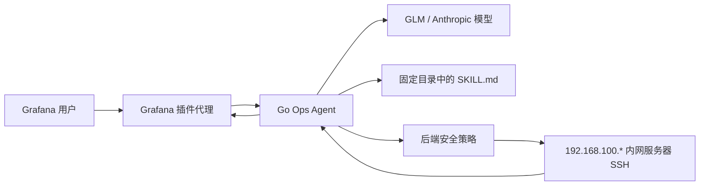

# 运维 Agent 简介报告

本文只说明当前 Ops Agent 的框架、流程、职责、权限和 Skill。结论以当前源码和配置为准，不代表生产环境已经部署了最新版本。

## 1. 框架

Ops Agent 是一个单任务、单服务器、受控 Shell 的运维编排器。它不保存长期记忆，也不是拥有完整主机权限的自治 Agent。



主要组件职责：

- Grafana 页面：选择一个内网节点、输入任务、展示 Skill、运行轨迹和待审批命令。
- Grafana 代理：注入内部 Bearer Token、Grafana 用户和角色信息。
- Go Agent：固定服务器上下文，驱动模型、Skill、Shell、审批和任务状态。
- 模型：负责分析、选择 Skill、提出工具调用和整理结果，不直接拥有服务器权限。
- Skill Loader：只加载配置目录下的 `SKILL.md`。
- Shell Executor：执行 SSH 命令、超时控制、输出截断和隐私脱敏。

## 2. 流程

1. Editor 在页面选择一个 `192.168.100.*` 内网节点并提交问题。
2. 后端根据服务端清单固定 `server_id`，不接受模型自行换服务器。
3. 模型先调用 `list_skills`，再按任务需要调用 `load_skill`。
4. 未加载 Skill 时，后端拒绝 `shell_exec`。
5. Shell 命令先经过通用安全校验、内网服务器校验和 Skill 校验。
6. 普通只读白名单命令和通过后端固定表达式白名单的只读 `./mgectl exprs` 自动执行；其他允许命令进入 Admin 审批。
7. Admin 批准后，后端再次执行全部校验，然后逐条执行命令。
8. Shell 输出经过脱敏和长度限制后返回模型，模型继续分析和验证。
9. 模型不再提出工具调用时，任务输出最终结果；任务状态变为 `completed` 或 `failed`。

模型一次返回多条工具调用时，Agent 按返回顺序逐条执行，不并发执行；遇到审批会暂停并保存剩余队列。

当前任务默认最长执行时间为 `30m`，任务和轨迹仅保存在进程内存中，任务 TTL 为 `30m`。任务超时、Agent 重启或过期后不能恢复。

## 3. 职责

Agent 负责：

- 分析 Erlang、BEAM、Exporter、主机资源、磁盘和节点告警。
- 按 Skill 采集最小必要证据。
- 提出单条、可解释、可验证的 Shell 命令。
- 对处理动作执行前后验证。
- 输出事实、判断、执行记录、验证结果和未解决项。

Agent 不负责：

- 长期记忆、跨任务恢复或持久化审计。
- 任意切换服务器、用户、端口、密钥或路径。
- 任意目录删除、主机重启、停服、手工杀进程或格式化设备。
- 绕过后端策略或用 Admin 审批替代安全校验。
- 仅凭 Shell 退出码判断业务已经恢复。

## 4. 权限

系统只保留三档 Grafana 权限：

- Viewer：查看监控总览和 Agent 健康状态，不能进入运维 Agent 页面。
- Editor：进入 Agent 页面、查看内网节点和 Skill、创建任务、查看自己创建的任务和轨迹，不能审批 Shell。
- Admin：拥有 Editor 权限，并能批准或拒绝自己创建任务中的待审批 Shell。

任务读取和审批都要求当前 Grafana 用户与任务创建者一致。Bear Token 是 Grafana 代理与 Agent 之间的内部服务凭据，不是用户可配置的服务器权限。

所有 Shell 执行只允许当前选定的、配置地址精确属于 `192.168.100.*` 的 `current-server`。监控机本地 Shell 和外部服务器 Shell 均不在当前执行范围内。

## 5. Shell 权限

### 自动执行的只读命令

整条命令仅由以下命令组成，并且没有危险 Shell 语法时，跳过审批：

```text
ls  grep  ps  cd  head  tail  df  find
```

允许这些命令使用 `|` 和 `&&`，也允许将标准输出、标准错误或两者精确重定向到 `/dev/null`（`>/dev/null`、`1>/dev/null`、`2>/dev/null`、`&>/dev/null`，目标前可有空格）。其他重定向、命令替换、后台执行、子 Shell、`;`、`||`，以及 `find` 的 `-exec/-execdir/-ok/-okdir/-delete/-fls/-fprint*` 不能跳过审批。

`erlang-ops-analysis` 已加载且命令通过服务器、服务目录和固定表达式白名单校验时，受控的只读 `./mgectl exprs` 同样跳过审批。GC、`mgectl start/stop/restart`、磁盘清理和其他处理动作不在此范围。

### 永久拒绝的操作

以下命令直接返回 `COMMAND_REJECTED`，不会进入审批：

- 删除白名单外的文件或目录。
- 关机、主机重启，以及白名单外的通用服务启动、停服和重启。
- `mkfs`、`wipefs`、`fdisk`、`parted` 等格式化或设备破坏操作。
- 向 `/dev/*` 写入或重定向；只读白名单命令精确输出到 `/dev/null` 的上述形式除外。
- `sudo`、`su`、`doas`。
- `kill`、`pkill`、`killall`、`taskkill`。
- `ssh`、`scp`、`sftp` 和 SSH 密钥工具。
- 读取 `/etc/ssh`、`.ssh`、SSH Host Key、公私钥、账号文件、Secret、Token、密码和进程环境。

这些规则是后端硬编码安全边界，不是配置项，Admin 批准也不能绕过。Shell 返回模型和页面前，还会对 SSH 公钥、私钥块、敏感路径、Token、密码和进程隐私输出进行脱敏。

### 允许的受控动作

只有对应 Skill 已加载、服务器属于 `192.168.100.*` 且命令格式通过后端校验时，以下动作才允许执行。固定只读 Erlang 诊断自动执行，处理动作进入 Admin 审批：

- Erlang 只读诊断：`erlang-ops-analysis` 只允许通过 `mgectl exprs` 调用固定的节点概览、内存/Heap/ETS/Mnesia/Atom、`monitor_*` 表达式，以及对本节点 PID 的单字段 `mlib_sys:info/2`。PID 格式、字段枚举和数值范围由后端校验；命中白名单后跳过审批。任意 Erlang 表达式、全消息/字典/raw binary/Atom 枚举及写操作仍被拒绝。

- BEAM GC：

  ```sh
  cd -- '<verified-server-dir>' && ./mgectl exprs "erlang:garbage_collect()"
  ```

- Erlang 单服务启动、停服和重启：

  ```sh
  cd -- '<verified-server-dir>' && ./mgectl start
  cd -- '<verified-server-dir>' && ./mgectl stop
  cd -- '<verified-server-dir>' && ./mgectl restart
  ```

- 磁盘清理：只允许 `internal-disk-space-recovery` Skill 中规定的两条固定命令，且只能清理 `/data/tmp/.Trash/` 内容和 `/data/tmp/` 下一级目录。

## 6. Skill

Skill 是运维流程和判断依据，不是权限绕过机制。Agent 只能从服务端固定的 `skills_dir` 加载合法的 `SKILL.md`；命令仍必须通过后端安全校验。

当前 Skill：

- `erlang-ops-analysis`：只读分析 Erlang 节点、Exporter、主机资源、BEAM 内存和监控告警；先按 processes、ETS、Mnesia、binary、atom/code 等类别分流，再使用受控的 `mlib_sys` 表达式定位进程或表，不执行处理动作。
- `erlang-node-gc`：指定服务时只检查该服务；未指定服务时逐一检查当前内网服务器全部已发现服务，只对符合条件的节点执行固定 `mgectl exprs "erlang:garbage_collect()"`，并逐服复核内存和节点状态；不启停或重启服务。
- `erlang-service-restart`：只负责用户明确指定的单个 Erlang 服务及 `mgectl start`、`mgectl stop` 或 `mgectl restart` 动作，并按动作复核服务状态；未指定服务时不批量启停。
- `internal-disk-space-recovery`：磁盘告警确认、`df` 取证、`.Trash` 优先清理，以及 `/data/tmp` 一级目录的受控清理。其他路径禁止删除。

Skill 与动作绑定：

- 未加载任何 Skill，不能执行 Shell。
- 只读 Erlang 分析加载 `erlang-ops-analysis`，后端只允许免审批只读命令和固定的 `mlib_sys` 诊断表达式。
- GC 必须加载 `erlang-node-gc`。
- `mgectl start/stop/restart` 必须加载 `erlang-service-restart`。
- 固定磁盘清理必须加载 `internal-disk-space-recovery`。
- Skill 只能指导当前任务，不能扩大服务器、路径或命令权限。
